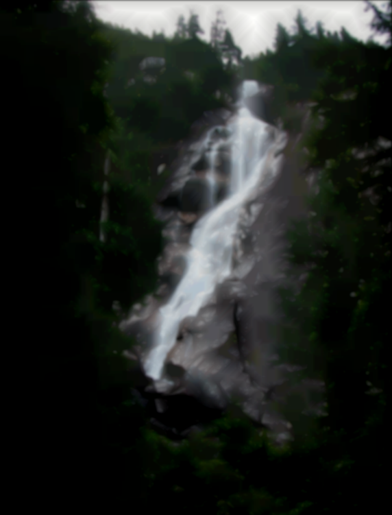

# Image_Filtering


## How to run with MPI


```bash
make

mpirexec -np <proc_num> ./mpi_ex <image> <image_type> <height> <width> <loops>
```

## How to run with MPI-OPENMP


```bash
make

mpirexec -np <proc_num> ./mpi_openmp_ex <image> <image_type> <height> <width> <loops>
```

## How to run with CUDA


```bash
make

./cuda_ex <image> <image_type> <height> <width> <loops> <blocksize>
```

## Results

#### GREY Image


##### Grey Image 10 loops


##### Grey Image 50 loops


##### Grey Image 90 loops


---


#### RGB Image


##### Grey Image 10 loops


##### Grey Image 50 loops


##### Grey Image 90 loops

